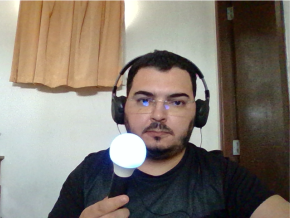
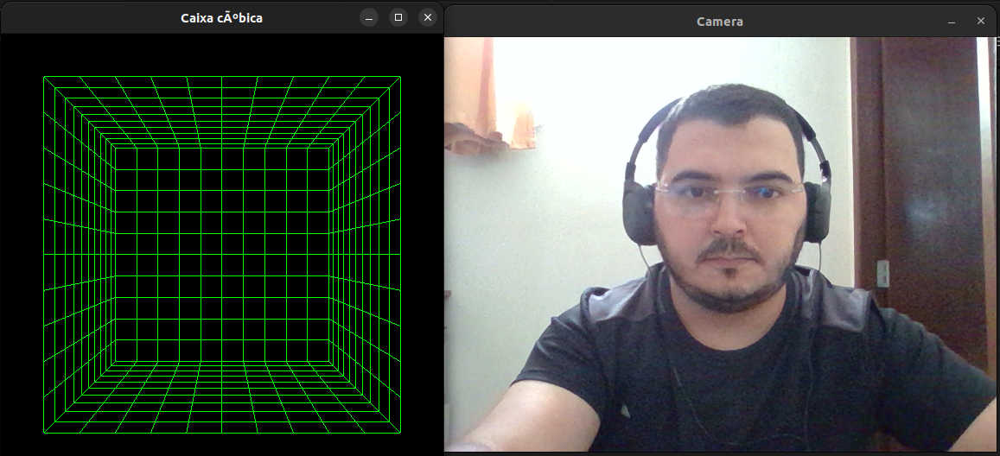
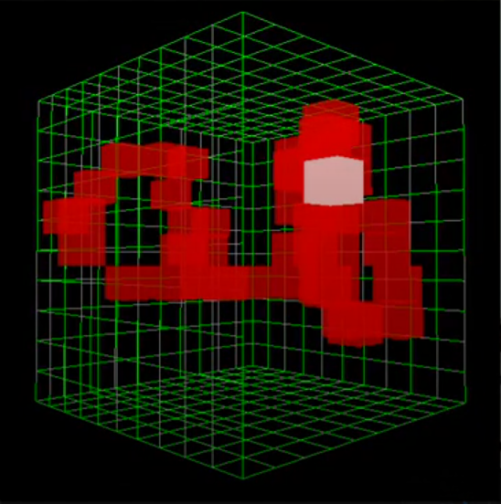

# 3D Painting Tool with Computer Vision Depth Tracking

This repository contains the source code for my **Undergraduate Thesis (TCC)** in Computer Engineering at the **Federal University of Rio Grande do Norte (UFRN)**.

The project integrates **OpenCV** and **OpenGL** to build an interactive system capable of real-time color tracking and 3D visualization. It allows users to draw in a three-dimensional virtual space using only a standard camera and computer vision algorithms — without requiring expensive depth sensors.

---

## 📖 Overview

* **Computer Vision (OpenCV):** Captures images in real time, applies color detection, contour extraction, and depth estimation.
* **3D Graphics (OpenGL + GLUT):** Renders a 3D environment where tracked objects are visualized and manipulated interactively.
* **Depth Calculation:** The Z-axis (depth) is estimated using the relative size of tracked objects.
* **Multithreading in C++:** Ensures synchronization between OpenCV (vision) and OpenGL (graphics) modules for real-time responsiveness.

This project demonstrates how accessible technologies can be combined to create low-cost interactive 3D systems, with potential applications in **education, simulations, and interactive art**.

---

## 🚀 Features

* Real-time **color tracking** of multiple objects.
* Conversion of tracked positions into **3D coordinates (X, Y, Z)**.
* Interactive **3D visualization and drawing** inside a cubic virtual environment.
* Camera-based **depth estimation** without specialized sensors.
* **Mouse interaction** to rotate and explore the 3D scene.

---

## 🛠️ Technologies Used

* **C++** (GCC compiler)
* **OpenCV** (image capture & processing)
* **OpenGL + GLUT** (3D rendering & interaction)
* **Multithreading** (C++ standard library)
* **Visual Studio Code** (development environment)

---

## ⚙️ Installation & Usage

### Prerequisites

* C++ compiler (GCC recommended)
* OpenCV installed
* OpenGL and FreeGLUT installed

### Build & Run

```bash
# Clone the repository
git clone git@github.com:LucasAzLima/ColorTrackingVisualizer.git
cd ColorTrackingVisualizer

# Compile (example command - adjust paths for OpenCV/OpenGL on your system)
g++ main.cpp -o app -lopencv_core -lopencv_highgui -lopencv_imgproc -lGL -lGLU -lglut -pthread

# Run
./app
```

---

## 📸 Example

To reproduce these results, run the application, configure the colors to be tracked, and move a colored object (controller) in front of the camera.  
The system will capture the movement in real time and render it inside the 3D cubic environment.

- **User holding the tracked controller:** The system uses a simple colored object as the input device, captured by a standard camera.  
  

- **System interface (camera + 3D cubic environment):** On the right, the camera feed used for color tracking; on the left, the 3D cubic environment rendered with OpenGL, where the tracked object will be visualized.  
  

- **Tracking and 3D drawing result:** The tracked controller movements are mapped into 3D coordinates, allowing interactive painting inside the cubic space.  
  


---

## 📚 Thesis Information

* **Title:** Development of a 3D Painting Tool with Computer Vision Depth Tracking
* **Author:** Lucas Lima
* **Advisor:** Prof. Dr. Agostinho de Medeiros Brito Júnior
* **Institution:** Federal University of Rio Grande do Norte (UFRN)
* **Year:** 2025

Full document: [TCC PDF](./docs/TCC_Lucas_Lima.pdf)

---

## 🔮 Future Improvements

* Support for **advanced tracking methods** (e.g., neural networks, feature-based tracking).
* **Robustness improvements** for variable lighting conditions and complex backgrounds.
* Optimization using modern APIs like **Vulkan** for enhanced rendering performance.
* Expansion of interactivity: **gesture recognition** and **multi-user environments**.

---

## 📄 License

This project is open-source and available under the **MIT License**.
Feel free to use and adapt it for educational and research purposes.
